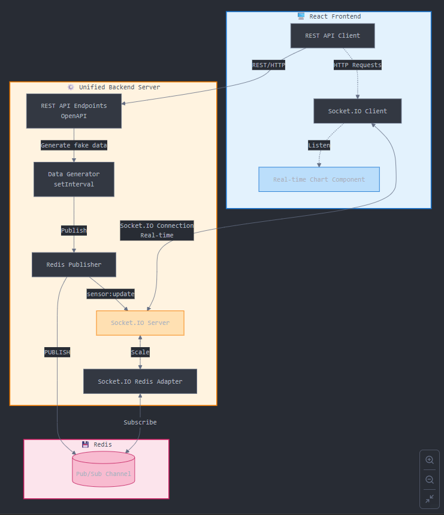

### Todo list:

- [x] React + Vite + TypeScript + Material-UI libraries initialization
- [x] Dynamic table with vertical scale
- [x] Backend data of general information
- [x] Backend data of image/pic
- [x] Server Dialog
- [x] Frontend fetching data and CSS for main page
- [x] Authentication & Authorization 
- [x] Dynamic sidebar when sign-in
- [x] Dynamic list contents for menu sidebar
- [ ] Backend data of menu sidebar
- [ ] Test other data on menu sidebar
- [ ] Test app locally (npm + Docker)
- [ ] Test deployment on Kubernetes (depl/ingr/svc + Prometheus + Grafana)
- [ ] Production 

### Architect used:
* Keep REST/OpenAPI for static + control logic
* Separate realtime using Redis Pub/Sub + WebSocket layer

Frontend communicate with restAPI backend            

Frontend communicate with real-time socket.io
