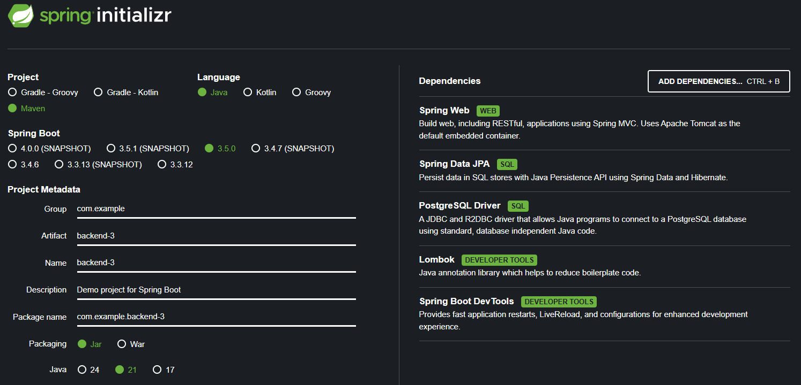

### Run program

```bash
mvn clean install (optional)
mvn spring-boot:run
```

### Swagger-UI Docs

```bash
http://localhost:5000/swagger-ui/index.html
```

### Download OpenAPI docs

```bash
JSON: http://localhost:5000/v3/api-docs
YAML: http://localhost:5000/v3/api-docs.yaml
```

### Realtime data, flow

| Components                      | Purpose                                                |
| ------------------------------- | ------------------------------------------------------ |
| `DataSimulator.java`            | Tạo dữ liệu giả lập, mô phỏng cảm biến.                |
| `RedisTemplate`                 | Dùng để publish dữ liệu vào Redis.                     |
| `RedisSubscriber.java`          | Đăng ký lắng nghe kênh Redis, xử lý dữ liệu nhận được. |
| `RedisMessageListenerContainer` | Hỗ trợ liên kết subscriber với Redis.                  |
| `SensorDataController`          | Cung cấp REST endpoint `/api/data`.                    |
| `DataWebSocketHandler`          | (Tuỳ chọn) Gửi dữ liệu tới WebSocket frontend.         |

### Setups

```bash
https://start.spring.io/
```

